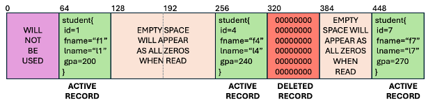

## Assignment 2:  Building a Simple Database

#### Introduction
For this assignment we will be building a simple database to manage student information.  The key data structure we will be using is found in the file `db.h`. In that file you will see a structure named `student_t`:

```c
typedef struct student{
    int id;
    char fname[24];
    char lname[32];
    int gpa; 
} student_t;
```
Note that I used a `typdef` so that you can refer to this structure in your code as either `struct student` or `student_t`.  This is a common convention used in the C programming language.  For example the following 2 lines of code are exactly the same, meaning both `student1` and `student2` are of the same type:

```c
struct student student1;
student_t      student2;
```

For this assignment you will be doing all I/O using Linux system calls via C to manage and manipulate the database file. The name of the database file you will be using for this assignment is `student.db`.  However, its never a good practice to hard code a constant like this in your code.  Instead use the `DB_FILE` constant that is `#define` inside of `db.h`.

#### Linux System Calls for File I/O
In class we started talked about linux system calls, and a little bit about some of the wrappering done by the C standard library.  For this assignment we will be using functions in the C standard library that call Linux system calls directly.  For example, you will be using these functions (and only these functions) to interface with the database file:

- `open()` : Opens a file
- `close()` : Closes a file
- `read()` : Read from a file
- `write()` : Write to a file
- `lseek()` : Seeks to a position in a file.  The next `read()` or `write()` will happen based on where you instructed `lseek()` to go within the file. 

Note if you need a refresher on these functions, google can be your friend, you can also read the online manuals, for example executing `man 2 open` from your terminal will provide all of the programming references for the `open()` syscall function.  Make sure you understand these functions prior to writing any code, or ask questions via discord, in class, or via office hours if you need more help.

#### What is provided to get you started?
Like assignment 1, scaffolded code has been provided to get you started.  There is a `makefile` to manage your builds along with the following other files:

- `db.h`:  A header file that includes the data structure for database records, along with other useful constants that you should use in your code.  For example, in several places you will need to know about the size of the `student_t` type.  The `db.h` file includes the `STUDENT_RECORD_SIZE` constant that you should use to make your code more readable.

- `sdbsc.h`:  A header file with many useful constants defined to help you with your implementation.  Also, this assignment requires output to be specifically formatted.  Rather than you having to work out the exact expected output format there are a number of `M_` defines in this header that you can just use as the first argument to the `printf()` function.  For example, one  of the things you will be implementing is a function named `count_db_records()` to count the number of records in the database. Lets say you decided to use a variable name `record_count` to store the total number of records in the database in your implementation.  Before you return from the `count_db_records()` function you would write the following code to ensure the output is as expected.   

    ```c
    if(record_count == 0){
        printf(M_DB_EMPTY);
    } else {
        printf(M_DB_RECORD_CNT, record_count);
    }
    ```

    Note that the console output for an empty database (`record_count=0`) would be:

    ```bash
    Database contains no student records.
    ```
    But for lets say a database with 5 records in it (`record_count=5`) the console would output:

    ```bash
    Database contains 5 student record(s).
    ```

    **NOTE that it will be very important for your output to exactly match the homework specification because we will be using the `bats` tool to unit test your submission. Anytime you are using `printf()` for output, the format string should be one of the constants defined in the `sdbsc.h` file.** 

- `sdbsc.c`:  The implementation of your database.  This is your starter code. Feel free to modify it in any way you wish.  The exact assignment requirements are specified in the next section of this document.  There is also some helpful information in this file to get you started.

#### Database File Organization
As mentioned above you will be storing records of type `student_t` in a file.  The exact position where you will be storing these records is based on the `id` field in the `student_t` structure.  Note that there are restrictions on allowable `id` values that are defined in the `db.h` file.  In a nutshell the `id` field is allowed to be in the range of `1 <= id <= 100000`.  

Now that we know that an `id` must be between `[1...100000]` inclusive, lets discuss how they will be stored in the database file.  



**FIGURE 1:  Database File Layout**

Figure 1 shows the layout of the database file.  Each `student_t` record takes exactly 64 bytes, so individual records will be aligned using the `id` field as the key.  Specifically, student with `id=x` will be located starting at byte `x * sizeof(student_t)`.  Linux supports sparse files very efficiently.  If you have a student with an `id` of 1000, the file size will be reported to be 64064 (remember id=1000 is really the 1001 record given the index is zero based).  We will investigate later how much storage is really used - spoiler alert - it will be about 4K.

```c
//example finding student 1000 using lseek system call
#include<unistd.h>

int student_id = 1000;
int offset = 1000 * sizeof(student_t);

lseek(fd, offset, SEEK_SET);

//now we are prepared to read or write student record 1000
```

While Linux does a good job managing sparse files, it does not support deleting data from the middle of files directly. This means we need a convention for representing deleted student records. As shown in the picture, we will write an instance of a `student_t` structure that is filled with all zeros. I defined `EMPTY_STUDENT_RECORD` in `db.h` that you can use. 

#### What you need to do
To complete this assignment take a look at the starter code.  I have implemented the `open_db()`, `validate_range()`, `usage()`, and `main()` functions for you.  These should not require any modification.  There are a number of functions in the starter that you need to implement.  They all are currently implemented as follows:

```c
return_type some_function_you_need_to_implement( /*function args */)
{
    printf(M_NOT_IMPL);
    return appropriate_value;
}
```

All of the directions are in comments above each function that you need to implement including required return values and required output. The starter code should compile correctly and support all of the program flags.  The functions you need to implement will output `"The requested operation is not implemented yet!"`.  Note that the compiler will produce several warnings about unused parameters in the starter code, you can ignore those as they will be needed for your implementation. 

**YOU MUST PRODUCE THE EXACT OUTPUT THAT WE EXPECT FOR THIS ASSIGNMENT AS WE WILL BE USING THE BATS TESTING FRAMEWORK TO EVALUATE YOUR CODE.  There is a sample testing script provided for you to use while you are doing development.  Recall that all of the required strings for your output have been predefined for you in `sdbsc.h`. They all start with `#define M_`**

#### Grading Rubric
This assignment will be weighted 75 points.

- 50 points:  Correct implementation of required functionality
- 5 points:  Code quality (how easy is your solution to follow)
- 20 points: Answering the written questions: [A2-Questions](./a2-questions.md)
- 5 points:  [EXTRA CREDIT] Implementation of the `compress_db(...)` function

Total points achievable is 80/75. 

#### Automated Testing
In order to help you out the starter package provides a testing script called `test.sh`.  You should expect your tests to fail when running the starter and then start to pass as you implement the required functionality.  Also note a few of the test cases are commented out.  These are good tests to explore how Linux manages sparse files.  They should work correctly if you are using a local VM.  However, tux uses an enterprise storage system called `ceph` that abstracts this information from us.  So if you are using tux these tests (using the `du` command) will not work. Feel free to uncomment these tests if you want to investigate the sparse nature of files on a local virtual machine. 


