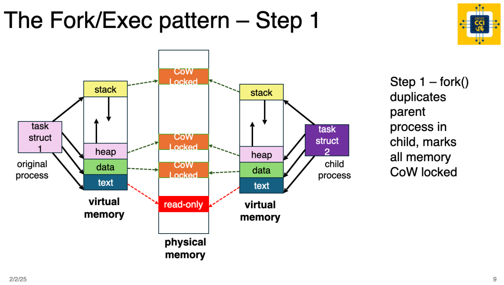
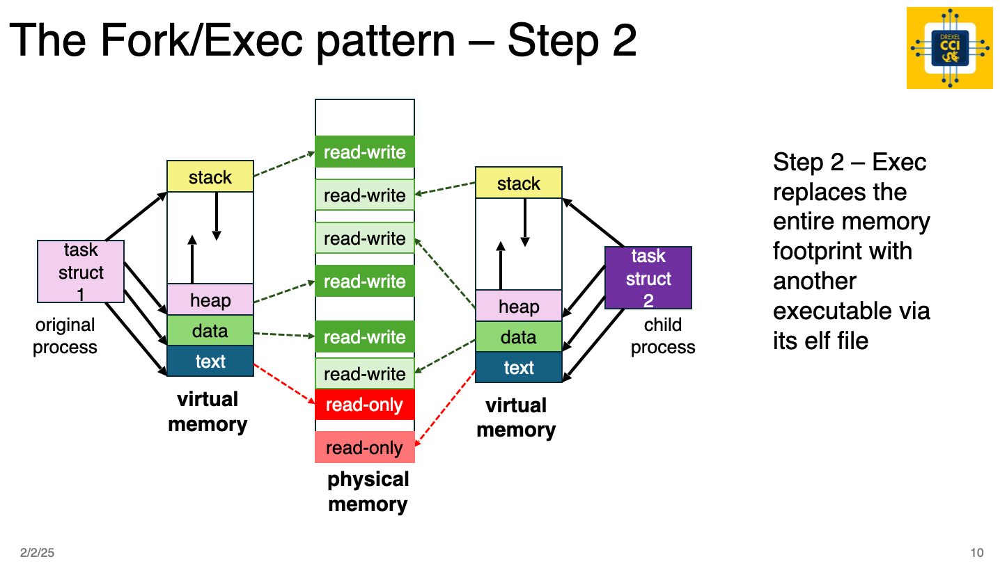

# Assignment: Custom Shell Part 2 - Fork/Exec

This week we will build on our `dsh` Drexel Shell by adding an implementation for the builtin command `cd`, and a `fork/exec` implementation to run "external commands".

This content builds on the prior assignment; if you need a refresher on what a shell is or the difference between built-in and external commands, please review the readme from that assignment.

# Reuse Prior Work!

The `dsh` assignments are meant to be additive. Much of the parsing logic from the last assignement can be re-used in this assignement. The structures are a little different so you might have to refactor some of your code, but that's a great practical lesson in software engineering; the highest quality results come from frequent iteration.

The next section highlights the differences (both conceptually and in file structure) from the prior assignement.

# Differences from Part 1 Assignment

- We've restructured the code slightly to move all implementation details into the lib file (`dshlib.c`) out of `dsh_cli.c`. **You do not need to write any code in `dsh_cli.c`!**
- This week we'll implement a fork/exec pattern to execute external commands; these commands should execute and behave just as they would if you ran them from your default shell; last week we only printed command lines that we parsed
- If you did the `dragon` extra credit, we moved the implementation into `dragon.c`
- We will NOT implement pipe splitting or multiple commands in one command line input; last week we implemented parsing the CLI by pipe just to print commands, but actually implementing pipes to execute commands is beyond the scope of this week's assignement - we will get to it but not this week!
  - This week we work with a single `cmd_buff` type at a time; we will not use the `command_list_t` from last week
  - This an example of some refactoring from last week's code, you can adapt your parsing logic but omit the pipe logic until we get to that in a future assignement

# Fork / Exec

Let's introduce two new system calls: fork() and exec(). These calls are fundamental to process creation and execution in all Unix-like operating systems. 

When a process calls fork(), the operating system creates a new child process that is an exact copy of the parent, inheriting its memory, file descriptors, and execution state. The child process receives a return value of 0 from fork(), while the parent receives the child's process ID. After forking, the child process often replaces its memory image with a new executable using one of the exec() family of functions (e.g., execl(), execv(), execvp()). 

Unlike fork(), exec() does not create a new process but instead replaces the calling process’s address space with a new program, preserving file descriptors unless explicitly changed. This mechanism allows Unix shells to execute new programs by first forking a child process and then using exec() to run the desired binary while the parent process waits for the child to complete using wait().

Recall the fork/exec pattern from lecture slides and demo - we are implementing this two-step process using system calls.





Remember that the fork/exec pattern requires you to use conditional branching logic to implement the child path and the parent path in the code. We did a basic demo of this in class using this demo code https://github.com/drexel-systems/SysProg-Class/blob/main/demos/process-thread/2-fork-exec/fork-exec.c. In the demo we used `execv()`, which requires an absolute path to the binary. In this assignement you should use `execvp()`; `execvp()` will search the `PATH` variable locations for binaries. As with the demo, you can use `WEXITSTATUS` to extract the status code from the child process.

# Assignment Details

### Step 1 - Review [./starter/dshlib.h](./starter/dshlib.h)

The file [./starter/dshlib.h](./starter/dshlib.h) contains some useful definitions and types. Review the available resources in this file before you start coding - these are intended to make your work easier and more robust!

### Step 2 - Implement `cd` in [./starter/dshlib.c](./starter/dshlib.c)

Building on your code from last week, implement the `cd` command.

- when called with no arguments, `cd` does nothing (this is different than Linux shell behavior; shells implement `cd` as `cd ~1` or `cd $HOME`; we'll do that in a future assignement)
- when called with one argument, `chdir()` the current dsh process into the directory provided by argument

### Step 3 - Re-implement Your Main Loop and Parsing Code in exec_local_cmd_loop() [./starter/dshlib.c](./starter/dshlib.c)

Implement `exec_local_cmd_loop()` by refactoring your code from last week to use 1 `cmd_buff` type in the main loop instead of using a command list. 

On each line-of-input parsing, you should populate `cmd_buff` using these rules:

- trim ALL leading and trailing spaces
- eliminate duplicate spaces UNLESS they are in a quoted string
- account for quoted strings in input; treat a quoted string with spaces as a single argument
  - for example, given ` echo    " hello,    world"  ` you would parse this as: `["echo", " hello,    world"]`; note that spaces inside the double quotes were preserved

`cmd_buff` is provided to get you started. You don't have to use this struct, but it is all that's required to parse a line of input into a `cmd_buff`.

```c
typedef struct cmd_buff
{
    int  argc;
    char *argv[CMD_ARGV_MAX];
    char *_cmd_buffer;
} cmd_buff_t;
```

### Step 4 - Implement fork/exec pattern in [./starter/dshlib.c](./starter/dshlib.c)

Implement fork/exec of external commands using `execvp()`. This is a pretty straight-forward task; once the command and it's arguments are parsed, you can pass them straight to `execvp()`.

Don't forget to implement a wait of the return code, and extraction of the return code. We're not doing anything with the return code yet, unless you are doing extra credit.

### Step 5 - Create BATS Tests

So far we've provided pre-built a `test.sh` file with assigments. These files use the [bash-based BATS unit test framework](https://bats-core.readthedocs.io/en/stable/tutorial.html#your-first-test).

Going forward, assignements will have a bats folder structure like this:

- your-workspace-folder/
  - bats/assignement_tests.sh
  - bats/student_tests.sh

**bats/assignment_tests.sh**

- DO NOT EDIT THIS FILE
- assignment_tests.sh contains tests that must pass to meet the requirements of the assignment
- it is run as part of `make test`; remember to run this to verify your code

**bats/student_tests.sh**

- this file must contain YOUR test suite to help verify your code
- for some assignments you will be graded on creation of the tests, and it is your responsibility to make sure the tests provide adequate coverage
- this file is also run with `make test`

**About BATS**

Key points of BATS testing - 

- file header is `#!/usr/bin/env bats` such that you can execute tests by simply running `./test_file.sh`
- incorrect `\r\n` can cause execution to fail - easiest way to avoid is use the [drexel-cci](https://marketplace.visualstudio.com/items?itemName=bdlilley.drexel-cci) extension to download assignement code; if you do not use this, make sure you do not copy any windows line endings into the file during a copy/paste
- assertions are in square braces
  - example: check output `[ "$stripped_output" = "$expected_output" ]`
  - example: check return code `$status` variable: `[ "$status" -eq 0 ]`

Please review the BATS link above if you have questions on syntax or usage. You can also look at test files we provided with assignment for more examples. **You will be graded on the quality of breadth of your unit test suite.**

What this means to you - follow these guidelines when writing tests:

- cover every type of functionallity; for example, you need to cover built-in command and external commands
- test for all use cases / edge cases - for example, for the built-in `cd` command you might want to verify that:
  - when called without arguments, the working dir doesn't change (you could verify with `pwd`)
  - when called with one argument, it changes directory to the given argument (again, you can verify with `pwd`)
- be thorough - try to cover all the possible ways a user might break you program!
- write tests first; this is called "Test Driven Development" - to learn more, check out [Martin Fowler on TDD](https://martinfowler.com/bliki/TestDrivenDevelopment.html)

### Step 6 - Answer Questions

Answer the questions located in [./questions.md](./questions.md).

### Sample Run with Sample Output
The below shows a sample run executing multiple commands and the expected program output:

```bash
./dsh 
dsh2> uname -a
Linux ubuntu 6.12.10-orbstack-00297-gf8f6e015b993 #42 SMP Sun Jan 19 03:00:07 UTC 2025 aarch64 aarch64 aarch64 GNU/Linux
dsh2> uname
Linux
dsh2> echo "hello,      world"
hello,      world
dsh2> pwd
/home/ben/SysProg-Class-Solutions/assignments/4-ShellP2/solution
dsh2> ls 
dir1  dragon.c  dragon.txt  dsh  dsh_cli.c  dshlib.c  dshlib.h  fancy_code_do_not_use  makefile  shell_roadmap.md  test.sh  wip
dsh2> cd dir1
dsh2> pwd
/home/ben/SysProg-Class-Solutions/assignments/4-ShellP2/solution/dir1
dsh2> 
```

### Extra Credit: +10

This week we're being naive about return codes from external commands; if there is any kind of failure, we just print the `CMD_ERR_EXECUTE` message.

Implement return code handling for extra credit. Hint - check out `man execvp` and review the `errno` and return value information.

Errno and value definitions are in `#include <errno.h>`. 

Tips:

- in the child process, `errno` will contain the error value if there was an error; so return this from your child process
- the `WEXITSTATUS` macro will extract `errno`

Requirements:

- Check for all file-related status codes from `errno.h` that you might expect when trying to invoke a binary from $PATH; for example - `ENOENT` is file not found, `EACCES` is permission denied
- Print a suitable message for each error you detect
- Implement a "rc" builtin command that prints the return code of the last operation; for example, if the child process returns `-1`, `rc` should output `-1`
- **Don't forget to add unit tests in** `./bats/student_tests.sh`!

Example run:

```bash
./dsh
dsh2> not_exists
Command not found in PATH
dsh2> rc
2
dsh2>
```

This extra credit is a precursor to implementing variables; shells set the variable `$?` to the return code of the last executed command. A full variable implementation is beyond the scope of this assignement, so we opted to create the `rc` builtin to mimic the behavior of the `$?` variable in other shells.

#### Grading Rubric

This assignment will be weighted 50 points.

- 25 points:  Correct implementation of required functionality
- 5 points:  Code quality (how easy is your solution to follow)
- 15 points: Answering the written questions: [questions.md](./questions.md)
- 15 points: Quality and breadth of BATS unit tests
- 10 points:  [EXTRA CREDIT] handle return codes for execvp

Total points achievable is 70/60. 


